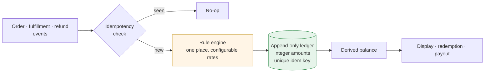

# Loyalty and Ledger Systems

Points, tiers, and rewards are the part of commerce where a rounding error is an accounting discrepancy and a duplicate webhook is a payout.

Case studies from three programs: a referral reward ledger whose balance is withdrawable as cash, a two-brand membership scheme layered onto a platform with no native concept of tiers, and point redemption at checkout against a balance owned by an ERP.

These are write-ups, not source. Client code, credentials, and infrastructure identifiers are deliberately absent.

## The recurring problems

Every loyalty system I have worked on hits the same four walls, in the same order.

**1. Points are money, and money is not a float.** Two decimal places is exactly the precision where floating-point arithmetic starts producing balances that don't reconcile. Every system here stores value as an integer in its smallest unit and formats for display at the edge.

**2. Accrual is triggered by events that arrive more than once.** Commerce webhooks are at-least-once. Any accrual path that isn't idempotent will eventually pay someone twice, and you will find out from a customer, not a monitor.

**3. Balance is a projection, not a column.** A `points` column on a customer row is a value with no history — you cannot answer "why is it this number", you cannot reverse one accrual without recomputing, and two concurrent writes silently lose one. An append-only ledger with a derived balance answers all three.

**4. The rules change more often than the schema should.** Tier thresholds, accrual rates, eligibility windows — these are business decisions revisited quarterly. Any design where a rate change requires a migration is a design that will fight its owners.

## Cases

| # | Case | Domain | Core problem |
|---|---|---|---|
| 01 | [Designing a withdrawable reward ledger](cases/01-withdrawable-reward-ledger.md) | US beauty-device brand | Balance converts to cash, so it must reconcile exactly |
| 02 | [Membership tiers on a platform with none](cases/02-membership-tiers-without-platform-support.md) | Racquet-sports and alpine-outdoor brands, Korea D2C | Per-customer pricing and purchase gates the platform can't express |
| 03 | [Simulating a tier change before shipping it](cases/03-simulating-a-tier-change.md) | Same | Changing thresholds moves real customers between tiers |
| 04 | [Point redemption at checkout](cases/04-point-redemption-at-checkout.md) | Korean outdoor gear retailer | The balance lives in an ERP; checkout won't wait |

## Related

The service architecture behind case 01 is written up separately in [commerce-backend-msa](https://github.com/hak2881/commerce-backend-msa) — this repo covers the ledger, that one covers the deployment and service boundaries.

## Stack

`Go` · `Python` (Django · FastAPI) · `PostgreSQL` · `Platform edge functions` (TypeScript) · `Kubernetes` · `AWS Lambda`

---

## 한국어 요약

포인트·등급·리워드는 반올림 오차가 그대로 회계 차액이 되고 중복 웹훅이 그대로 지급이 되는 영역입니다. 프로그램 세 개의 사례를 담았습니다. 잔액을 현금으로 인출할 수 있는 추천 보상 원장, 등급 개념이 없는 플랫폼 위에 올린 2개 브랜드 멤버십, ERP가 들고 있는 잔액을 체크아웃에서 차감하는 포인트.

**반복해서 부딪히는 네 개의 벽** (늘 같은 순서로 옵니다)

1. **포인트는 돈이고, 돈은 float가 아닙니다.** 소수점 두 자리는 부동소수 연산이 어긋난 잔액을 만들어내기 시작하는 딱 그 정밀도입니다. 여기 나오는 시스템은 전부 값을 최소 단위 정수로 저장하고, 화면에 보여줄 때만 변환합니다.
2. **적립을 유발하는 이벤트는 두 번 이상 옵니다.** 커머스 웹훅은 at-least-once입니다. 멱등하지 않은 적립 경로는 언젠가 누군가에게 두 번 지급하고, 그 사실은 모니터링이 아니라 고객을 통해 알게 됩니다.
3. **잔액은 컬럼에 들고 있지 않고 원장을 더해서 구합니다.** 고객 행에 `points` 컬럼 하나를 두면 이력이 없는 값이 됩니다. "왜 이 숫자인지" 답할 수 없고, 재계산 없이 적립 하나만 되돌릴 수도 없고, 동시에 쓰기가 두 번 들어오면 하나가 조용히 사라집니다. append-only 원장에서 잔액을 구하면 세 가지가 다 풀립니다.
4. **규칙은 스키마보다 자주 바뀝니다.** 등급 기준, 적립률, 적용 기간은 분기마다 다시 들여다보는 비즈니스 결정입니다. 요율 하나 바꾸는 데 마이그레이션이 필요한 설계는 결국 주인과 싸우게 됩니다.

| # | 케이스 | 도메인 | 핵심 문제 |
|---|---|---|---|
| 01 | 인출 가능한 보상 원장 설계 | 미국 뷰티 디바이스 브랜드 | 잔액이 현금이 되므로 정확히 맞아야 함 |
| 02 | 등급 기능이 없는 플랫폼 위의 멤버십 | 라켓스포츠·알파인 아웃도어 브랜드 국내 D2C | 플랫폼이 표현 못 하는 고객별 가격과 구매 게이트 |
| 03 | 등급 개편을 배포 전에 시뮬레이션 | 동일 | 기준을 바꾸면 실제 고객이 등급 사이를 이동함 |
| 04 | 체크아웃 포인트 차감 | 국내 아웃도어 기어 리테일러 | 잔액은 ERP에 있고 체크아웃은 기다려주지 않음 |
