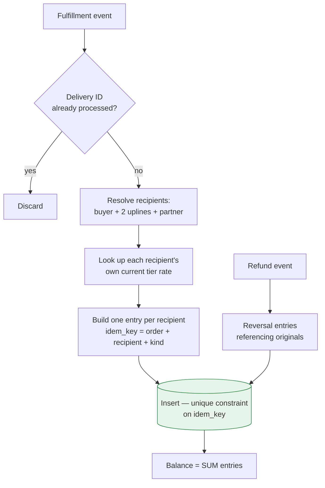

# Designing a Withdrawable Reward Ledger

**Domain** · US beauty-device brand, distributor network on a single Shopify Plus store
**Constraint** · Balance converts to cash. It must reconcile exactly, forever.

## Context

Members recruit members. Every order accrues to the buyer and to two levels above them, each at their own tier rate. A separate class of Partner accounts can withdraw their balance as money to a connected payout account.

That last sentence is what makes this a ledger problem rather than a points feature. The moment a balance leaves the system as cash, every entry that produced it has to be defensible.

## Problem

**One order produces several entries, to several people, at different rates.** A single fulfillment can credit the buyer, two uplines, and a partner — four ledger entries, four different rate bases, all from one event. Any of them can be wrong independently.

**Rates are per-recipient, not per-order.** Each recipient accrues at *their own* current tier rate, not the buyer's. So the calculation cannot be done once and distributed; it has to be resolved per recipient at accrual time.

**Everything can be reversed.** Refunds, cancellations, and order edits all have to unwind accrual — including accrual that has already been partially spent or withdrawn.

**Two decimal places, converted to dollars.** Points carry hundredths and convert at a fixed rate to currency. This is the precision band where float arithmetic produces balances that are off by a cent, in a system where a cent discrepancy is a support ticket and eventually an audit question.

## Approach

**Append-only, never update.** The ledger only gains rows. An accrual is a row; a reversal is another row with the opposite sign referencing the original; a redemption is a row. Balance is the sum. No entry is ever modified or deleted, which means the answer to "why is this balance what it is" is always a query rather than an inference.

**Idempotency is a database constraint, not application logic.** Each entry's key is derived from the order, the recipient, and the kind of accrual, with a unique index on it. A replayed webhook attempts an insert that the database rejects. There is no read-then-write window for a race to slip through, and no code path where "did we already do this" is answered by a query that could be stale.

This is the crucial choice. Application-level dedup checks are correct until two webhook deliveries are processed concurrently, which is exactly what happens during a retry storm.

**Integers in the smallest unit, formatted only for display.** Money is `int64` cents. Points are `int64` at hundredths — `3.33 pt` is stored as `333`. Nothing in the accrual, reversal, or withdrawal path handles a float. Conversion to a human-readable decimal happens in the serializer at the API edge and nowhere else.

**Rates are configuration read at accrual time.** Tier rates for the tree component are administrator-editable; the fixed-policy rates are constants in the rule engine. Both live in one service. A rate change takes effect for subsequent accrual and does not retroactively alter existing entries — which is correct, because those entries record what was actually promised at the time.

**One ledger, with withdrawal as a permission.** The system originally had two ledgers: ordinary store credit and cashable points. That split encoded a *policy* question — who is allowed to cash out — in the *data model*. Every policy revision became a data migration, and every balance query became a union across two tables.

Collapsing to a single ledger, with withdrawal eligibility read from the account's partner flag, was the highest-leverage change in the system. Cash-out capability is an authorization question. It belongs in the permission layer, not in the storage layer.

**Accrual fires at fulfillment, not at payment.** An order that is paid but never shipped should not have paid out rewards to three people. Moving the trigger to fulfillment (and to pickup completion for local pickup) means the reward follows the goods, which is also the point at which a reversal becomes rare rather than routine.

## Outcome

- Duplicate accrual prevented at the database layer, not by application checks — a retried webhook is a rejected insert
- Two ledgers merged into one with historical balances migrated; withdrawal reduced to a permission check
- Full accrual history queryable per member and per order, so any balance can be explained entry by entry
- No floating-point arithmetic anywhere in the value path

## What I would revisit

Balance is computed by summing the ledger. That is correct and stays correct, but it is linear in a member's history and there is no snapshot. A periodic checkpoint row — balance as of a date, with subsequent entries summed on top — would keep the audit trail intact while bounding the read cost. Worth doing before, not after, the ledger gets large.

---

## 한국어 요약

회원이 회원을 모집하고, 모든 주문이 구매자와 그 위 두 단계에게 각자의 등급률로 적립됩니다. 별도의 Partner 등급은 잔액을 연결된 지급 계정으로 **현금 인출**할 수 있습니다. 마지막 문장 때문에 이건 포인트 기능이 아니라 원장 문제가 됩니다. 잔액이 현금으로 시스템을 떠나는 순간, 그 잔액을 만든 항목 하나하나를 설명할 수 있어야 하니까요.

**어려웠던 지점**

- **주문 하나가 여러 사람에게 서로 다른 요율로 여러 항목을 만듭니다.** 배송 한 건으로 구매자, 업라인 2명, 파트너까지 원장 4행이 생기고, 각각 따로 틀릴 수 있습니다.
- **요율은 주문이 아니라 수령자에게 붙습니다.** 각 수령자가 자기 현재 등급률로 적립받습니다. 그래서 한 번 계산해서 나눠줄 수 없고, 적립 시점에 수령자별로 다시 따져야 합니다.
- **모든 것이 되돌려질 수 있습니다.** 환불·취소·주문 수정이 전부 적립을 되감아야 하고, 여기에는 이미 일부 쓰였거나 인출된 적립까지 포함됩니다.
- **소수점 두 자리에 통화 환산까지 붙습니다.** float가 1센트씩 어긋난 잔액을 만들어내는 바로 그 정밀도 구간이고, 여기서 1센트 차이는 문의 티켓이 되고 결국 감사 질문이 됩니다.

**접근**

- **Append-only, update는 하지 않습니다.** 원장은 행이 늘기만 합니다. 적립이 한 행, 취소는 원본을 참조하는 반대 부호의 다른 행, 사용은 또 한 행. 잔액은 그 합계입니다. 어떤 항목도 수정하거나 지우지 않으니 "이 잔액이 왜 이 숫자인가"는 추론할 필요 없이 쿼리로 답이 나옵니다.
- **멱등성은 애플리케이션 로직이 아니라 DB 제약으로.** 항목 키를 주문·수령자·적립 종류로 만들고 unique 인덱스를 겁니다. 재전송된 웹훅은 DB가 거절하는 insert가 됩니다. 레이스가 끼어들 read-then-write 구간이 없고, "이미 처리했나"를 낡았을 수 있는 쿼리로 답하는 경로도 없습니다. 이게 결정적인 선택이었습니다. 애플리케이션 레벨 dedup은 웹훅 두 건이 동시에 처리되기 전까지만 맞는데, 그 동시 처리가 바로 재시도가 몰릴 때 일어납니다.
- **최소 단위 정수로 저장하고 표시할 때만 변환.** 금액은 센트 `int64`, 포인트는 ×100 `int64`로 둡니다 (3.33pt → 333). 적립·취소·인출 경로 어디에도 float가 없고, 십진 변환은 API 엣지의 시리얼라이저에서만 합니다.
- **요율은 적립 시점에 읽는 설정값.** 트리 적립 등급률은 관리자가 편집할 수 있고, 정책상 고정된 요율은 규칙 엔진 안의 상수입니다. 둘 다 한 서비스에 모여 있습니다. 요율을 바꾸면 그 이후 적립부터 적용되고 기존 항목은 소급해서 고치지 않습니다. 그 항목들은 당시 실제로 약속한 값을 기록한 것이니 그게 맞습니다.
- **원장은 하나로, 인출은 권한으로.** 원래는 스토어 크레딧과 현금화 포인트, 원장이 둘이었습니다. 이 분리는 "누가 현금화할 수 있는가"라는 정책 질문을 데이터 모델에 새겨 넣은 셈이라, 정책이 바뀔 때마다 데이터 이관을 해야 했고 잔액 조회는 매번 두 테이블 union이 됐습니다. 원장 하나에 파트너 권한 판정을 얹는 쪽으로 접은 게 이 시스템에서 가장 레버리지가 큰 변경이었습니다. **현금화는 인가 문제이고, 인가 계층에서 다룰 일입니다.**
- **적립은 결제가 아니라 배송 시점에.** 결제만 되고 출고되지 않은 주문이 세 사람에게 보상을 지급하면 안 됩니다. 트리거를 배송(로컬 픽업이면 픽업 완료) 시점으로 옮기면 보상이 물건을 따라가고, 되감기가 일상이 아니라 예외가 됩니다.

**결과**

- 중복 적립을 애플리케이션 체크가 아니라 DB 계층에서 차단 — 재전송 웹훅은 거절된 insert
- 원장 2개를 1개로 통합하고 과거 잔액을 이관, 인출은 권한 체크로 축소
- 회원별·주문별 전체 적립 이력 조회 가능 — 어떤 잔액이든 항목 단위로 설명 가능
- 값이 지나가는 경로 전체에 부동소수 연산 없음

**다시 한다면** — 잔액을 원장 합산으로 구합니다. 맞는 방식이고 앞으로도 맞지만, 회원 이력에 선형으로 비례하고 스냅샷이 없습니다. 주기적으로 체크포인트 행(특정 시점의 잔액)을 남기고 그 이후 항목만 더하면, 감사 추적을 그대로 두면서 읽기 비용에 상한을 둘 수 있습니다. 원장이 커진 뒤가 아니라 커지기 전에 해야 할 일입니다.
