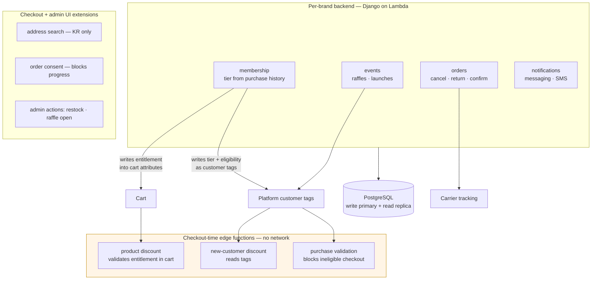

# Membership Tiers on a Platform With None

**Domain** · Racquet-sports brand and alpine-outdoor brand, Korea D2C — two storefronts, parallel systems
**Constraint** · Every membership behaviour has to be expressed through platform primitives that were designed for something else

## Context

Two sports brands running Korean direct-to-consumer storefronts on the same commerce platform, with separate backends built on the same architecture. Both run membership programs: tiers earned from purchase history, tier-dependent pricing, member-only launches, and raffle-gated products.

None of that exists in the platform. What the platform has is discounts, tags, and metafields — and a sandboxed function runtime at checkout with no network access.

## Problem

**Per-customer pricing is not a discount code.** A tier discount is a function of *this customer* and *this product*: a gold member gets a different percentage on a racquet than a silver member does on a jacket. The platform's discount primitives take a code or a fixed rule. There is no primitive for "ask my server what this person should pay."

**Checkout logic runs in a sandbox with no network.** The platform's edge functions execute inside checkout with a hard latency budget and no outbound calls. Anything the function needs to know has to already be present in the cart when the function runs. You cannot look anything up.

**Purchase eligibility is a gate, not a price.** Launch products and raffle items must be blocked from checkout entirely for customers who aren't entitled — not discounted, refused. That is a different platform extension point with different semantics.

**Two brands, two of everything.** Separate stores, separate backends, separate app installations, different platform API versions. Every capability had to be built such that the second brand was a deployment rather than a rewrite.

## Architecture

## Key decisions

**Entitlement is carried, not queried.** Since the checkout function cannot call out, the backend places the customer's entitlement into the cart before checkout, and the function's job is to *validate and apply* what it finds rather than to decide anything. The decision stays on the server where the membership rules live; only the conclusion travels.

This is the general shape of any logic that has to run inside a sandboxed checkout: compute early, carry the result, verify at the edge. The verification step is not optional — a value that arrives from the client is a claim, and the function's entire purpose is to confirm it matches the customer and product actually in the cart before honouring it.

**Tags for coarse state, cart attributes for per-line state.** Tier membership and raffle-winner status are properties of a customer that change rarely and apply broadly — they live as customer tags the platform indexes and the functions can read directly. Per-line entitlement changes with every cart and belongs on the line. Using tags for both would mean rewriting customer records on every cart change; using attributes for both would mean the coarse state disappears whenever a cart is abandoned.

**Blocking is a separate extension point from pricing.** Launch and raffle gating is implemented as purchase validation — it refuses checkout with a message — rather than as a 100% discount or a hidden product. A product that is hidden can still be reached by direct link; a product priced at zero can still be bought. Only the validation point actually stops the transaction, and it is the only one that can explain why.

**Consent collection blocks progress rather than logging.** Korean commerce requires explicit order consent. The extension is configured to prevent checkout from advancing until consent is given, which means the consent record and the order cannot disagree — there is no path where an order exists without one.

**Admin actions live where the admin already is.** Restock completion and raffle opening are triggered from the product detail page in the platform admin, calling the backend directly, rather than from a separate internal tool. Operations staff work in one place; the number of systems someone has to log into is itself a design decision.

**Read/write splitting at the ORM router.** Membership and tier lookups are read-heavy and happen on nearly every page. Writes go to the primary, reads to the replica, routed at the ORM layer so no view or task has to remember which is which.

**Two brands as a shared architecture, not shared code.** The brands run separate deployments with separate databases and separate app installations — they launch independently, run different platform API versions, and a bad deploy on one cannot take down the other. What is shared is the design: the same service layout, the same extension strategy, the same operational model. Copying an architecture across two clients is cheap; coupling two brands' release schedules is not.

## Outcome

- Tier-dependent pricing applied inside a checkout that has no ability to call a server, with entitlement verified at the edge rather than trusted
- Launch and raffle products genuinely unbuyable by ineligible customers, with an explanatory message rather than a silent failure
- Consent capture that cannot be bypassed, satisfying a domestic commerce requirement structurally rather than procedurally
- Two brands shipped on one architecture with independent release cycles

---

## 한국어 요약

두 개의 스포츠 브랜드 국내 D2C 스토어. 같은 플랫폼 위에서 같은 아키텍처의 별도 백엔드로 돌아갑니다. 둘 다 멤버십을 운영합니다 — 구매 이력 기반 등급, 등급별 가격, 회원 전용 런칭, 래플 한정 상품. **플랫폼에는 그중 아무것도 없습니다.** 있는 건 할인·태그·메타필드, 그리고 **네트워크 접근이 없는 체크아웃 샌드박스 함수 런타임**뿐입니다.

**어려웠던 지점**

- **고객별 가격은 할인 코드가 아닙니다.** 등급 할인은 *이 고객* × *이 상품*의 함수입니다. 골드 회원의 라켓 할인율과 실버 회원의 재킷 할인율이 다릅니다. 플랫폼 할인 프리미티브는 코드나 고정 규칙을 받습니다. **"이 사람이 얼마 내야 하는지 내 서버에 물어봐"라는 프리미티브는 없습니다.**
- **체크아웃 로직은 네트워크 없는 샌드박스에서 돕니다.** 엄격한 지연 예산 안에서 실행되고 아웃바운드 호출이 불가능합니다. 함수가 알아야 할 것은 실행 시점에 **이미 장바구니에 있어야** 합니다. 조회는 없습니다.
- **구매 자격은 가격이 아니라 게이트입니다.** 런칭 상품과 래플 상품은 자격 없는 고객에게 할인이 아니라 **거절**되어야 합니다. 이건 의미론이 다른 별개의 확장 지점입니다.
- **브랜드 둘이면 모든 게 둘입니다.** 별도 스토어·백엔드·앱 설치, 플랫폼 API 버전도 다릅니다. 두 번째 브랜드가 재작성이 아니라 배포가 되도록 모든 기능을 만들어야 했습니다.

**핵심 결정**

- **자격은 조회하는 게 아니라 실어 보냅니다.** 체크아웃 함수가 밖으로 호출할 수 없으니, 백엔드가 체크아웃 전에 고객의 자격을 장바구니에 넣고, 함수의 일은 **판단이 아니라 발견한 것을 검증하고 적용**하는 것입니다. 판단은 멤버십 규칙이 사는 서버에 남고 결론만 이동합니다. 샌드박스 체크아웃 안에서 돌아야 하는 모든 로직의 일반형입니다 — **미리 계산하고, 결과를 싣고, 엣지에서 검증한다.** 검증은 선택이 아닙니다. 클라이언트에서 온 값은 **주장**이고, 함수의 존재 이유가 그 주장이 실제 장바구니의 고객·상품과 일치하는지 확인하는 것입니다.
- **태그는 성긴 상태, 장바구니 속성은 라인별 상태.** 등급과 래플 당첨 여부는 드물게 바뀌고 넓게 적용되는 고객 속성이라 플랫폼이 색인하는 고객 태그에 둡니다. 라인별 자격은 장바구니마다 달라지므로 라인에 둡니다. 둘 다 태그로 하면 장바구니가 바뀔 때마다 고객 레코드를 다시 쓰게 되고, 둘 다 속성으로 하면 장바구니를 버릴 때마다 성긴 상태가 사라집니다.
- **차단은 가격과 다른 확장 지점입니다.** 런칭·래플 게이팅은 100% 할인이나 상품 숨김이 아니라 **구매 검증**(메시지와 함께 결제 거부)으로 구현했습니다. 숨긴 상품은 직접 링크로 도달 가능하고, 0원 상품은 여전히 구매 가능합니다. 실제로 거래를 멈추는 건 검증 지점뿐이고, **이유를 설명할 수 있는 것도 그것뿐**입니다.
- **동의 수집은 기록이 아니라 진행 차단.** 국내 커머스는 명시적 주문 동의가 필요합니다. 동의 전에는 체크아웃이 진행되지 않도록 설정해서, 동의 기록과 주문이 어긋날 수 없게 했습니다. **동의 없는 주문이 존재할 경로 자체가 없습니다.**
- **관리 액션은 관리자가 이미 있는 곳에.** 재입고 완료·래플 오픈을 별도 내부 도구가 아니라 플랫폼 어드민 상품 상세 화면에서 백엔드로 직접 호출합니다. 운영 인력이 한 곳에서 일하게 하는 것 — **로그인해야 할 시스템의 개수 자체가 설계 결정**입니다.
- **읽기/쓰기 분리는 ORM 라우터에서.** 멤버십·등급 조회는 거의 모든 페이지에서 일어나는 읽기 중심 작업입니다. 쓰기는 프라이머리, 읽기는 리플리카로 ORM 계층에서 라우팅해 어떤 뷰나 태스크도 이걸 기억할 필요가 없게 했습니다.
- **두 브랜드는 코드 공유가 아니라 아키텍처 공유.** 별도 배포·별도 DB·별도 앱 설치로, 독립적으로 런칭하고 플랫폼 API 버전도 다르며 한쪽의 잘못된 배포가 다른 쪽을 죽이지 못합니다. 공유하는 건 설계입니다 — 같은 서비스 구성, 같은 확장 전략, 같은 운영 모델. **아키텍처를 복사하는 건 싸지만, 두 브랜드의 릴리스 일정을 묶는 건 비쌉니다.**

**결과**

- 서버 호출이 불가능한 체크아웃 안에서 등급별 가격 적용 — 자격을 신뢰하지 않고 엣지에서 검증
- 런칭·래플 상품이 자격 없는 고객에게 실제로 구매 불가 (조용한 실패가 아니라 설명 메시지)
- 우회 불가능한 동의 수집 — 국내 커머스 요건을 절차가 아니라 **구조로** 충족
- 두 브랜드를 하나의 아키텍처로, 독립된 릴리스 주기로 운영
