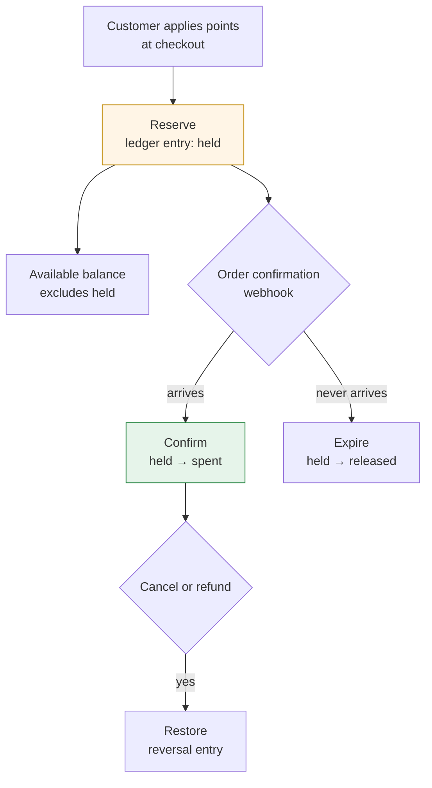

# Point Redemption at Checkout

**Domain** · Korean outdoor gear retailer, membership originating in a legacy ERP
**Constraint** · The deduction happens inside a checkout the platform owns, driven by events that arrive more than once

## Context

Members accumulate points and spend them against orders. Straightforward, until you look at where each half of that sentence actually executes.

Accrual is driven by order webhooks arriving from the platform, asynchronously, possibly twice. Redemption happens inside checkout, synchronously, while the customer waits — and the checkout is the platform's, not mine.

## Problem

**Deduction and order creation are not one transaction.** The points are in my database; the order is created in the platform. There is no shared transaction across that boundary. Every failure mode lives in the gap: points deducted for an order that never completes, or an order completed against points that were never deducted.

**The webhook that confirms the order can arrive twice.** If confirmation drives the deduction, a retry deducts twice. If the deduction happens earlier, an abandoned checkout silently consumes a balance.

**Cancellations and refunds have to give points back.** And they arrive as their own webhooks, with the same at-least-once guarantee, so restoration needs the same protection as deduction.

**The balance must be right at the moment of purchase.** Not eventually consistent with it. A customer who sees 5,000 points and is told at payment they have 3,000 has been shown a lie by whichever system was slower.

## Approach

**Reserve, then confirm.** Redemption is two steps against an append-only ledger. At checkout the amount is *reserved* — a ledger entry that removes it from available balance without finalizing it. When the order confirmation webhook arrives, the reservation is *confirmed*. If it never arrives, the reservation expires and the points return.

This is the standard two-phase shape, and it is the only one that gets both failure directions right. A single-step deduction has to choose which way to be wrong: deduct early and lose points on abandonment, or deduct late and let two concurrent checkouts spend the same balance.

**Idempotency keys on every transition.** Reserve, confirm, expire, and restore each carry a key derived from the order and the operation, with a unique constraint. A replayed webhook is a rejected insert rather than a second deduction. The database enforces this, not the application — there is no read-then-write window for concurrent deliveries to race through.

**Available balance excludes held amounts by construction.** It is derived from the ledger — total accrued, minus spent, minus currently held — rather than stored as a column and adjusted. There is no state where a reservation exists but the displayed balance doesn't reflect it.

**Reservations expire on a timer, and expiry is a ledger entry too.** An abandoned checkout should not hold points indefinitely. Expiry is recorded as a transition rather than a deletion, so the history remains complete and "where did my points go and come back" is answerable.

**Accrual fires on the same event that makes the order real.** Points earned by an order accrue when the order is confirmed, on the same webhook, through the same idempotency mechanism. Accrual and redemption share the ledger and the protection.

## Outcome

- Redemption survives both failure directions — an abandoned checkout returns the points, a retried webhook cannot deduct twice
- Balance shown at checkout and balance charged at payment cannot disagree, because both derive from the same ledger with holds included
- Cancellation and refund restore points as reversal entries, leaving the accrual history intact rather than editing it away
- Every movement of a point is a row with a reason, so a customer question is a query

---

## 한국어 요약

회원이 포인트를 쌓고 주문에 씁니다. 간단해 보이지만, 그 문장의 두 절반이 **어디서 실행되는지** 보면 달라집니다. 적립은 플랫폼에서 오는 주문 웹훅이 비동기로, 어쩌면 두 번 유발합니다. 차감은 체크아웃 안에서 동기로, 고객이 기다리는 동안 일어나고, **그 체크아웃은 내 것이 아니라 플랫폼 것**입니다.

**어려웠던 지점**

- **차감과 주문 생성은 한 트랜잭션이 아닙니다.** 포인트는 내 DB에, 주문은 플랫폼에 생깁니다. 그 경계를 걸치는 공유 트랜잭션은 없습니다. **모든 장애 모드가 그 틈에 있습니다** — 완료되지 않은 주문 때문에 차감된 포인트, 또는 차감되지 않은 포인트로 완료된 주문.
- **주문을 확정하는 웹훅이 두 번 올 수 있습니다.** 확정이 차감을 유발하면 재전송이 두 번 차감합니다. 차감이 더 앞에서 일어나면 이탈한 체크아웃이 조용히 잔액을 먹습니다.
- **취소·환불은 포인트를 돌려줘야 합니다.** 이것도 같은 at-least-once 보장의 웹훅으로 오므로 복원에도 차감과 같은 보호가 필요합니다.
- **잔액은 구매 그 시점에 맞아야 합니다.** 5,000점을 보고 들어왔는데 결제에서 3,000점이라고 하면, 둘 중 느린 시스템이 고객에게 거짓말을 한 것입니다.

**접근 — 예약 후 확정(reserve → confirm).** 차감을 append-only 원장에 대한 2단계로 처리합니다. 체크아웃에서 금액을 **예약**(가용 잔액에서 빼되 확정하지 않는 원장 항목)하고, 주문 확정 웹훅이 오면 **확정**합니다. 오지 않으면 예약이 만료되고 포인트가 돌아옵니다.

이게 표준 2단계 형태이고, **양쪽 장애 방향을 모두 맞추는 유일한 형태**입니다. 단일 단계 차감은 어느 쪽으로 틀릴지 골라야 합니다 — 일찍 빼서 이탈 시 포인트를 잃거나, 늦게 빼서 동시 체크아웃 두 개가 같은 잔액을 쓰게 하거나.

**핵심 결정**

- **모든 전이에 멱등 키.** 예약·확정·만료·복원 각각이 주문과 연산에서 파생된 키를 갖고 unique 제약이 걸립니다. 재전송 웹훅은 두 번째 차감이 아니라 거절된 insert입니다. 애플리케이션이 아니라 **DB가 강제**하므로 동시 전달이 통과할 read-then-write 구간이 없습니다.
- **가용 잔액은 구조적으로 예약분을 제외합니다.** 컬럼에 저장하고 조정하는 게 아니라 원장에서 파생합니다 — 총적립 − 사용 − 현재 예약. **예약은 존재하는데 표시 잔액에 반영 안 된 상태 자체가 없습니다.**
- **예약은 타이머로 만료되고, 만료도 원장 항목입니다.** 이탈한 체크아웃이 포인트를 무기한 잡고 있으면 안 됩니다. 삭제가 아니라 전이로 기록해서 이력이 온전하게 남고, "포인트가 왜 빠졌다가 돌아왔나"에 답할 수 있습니다.
- **적립은 주문을 실체화하는 바로 그 이벤트에서.** 주문으로 얻는 포인트는 주문 확정 시, 같은 웹훅에서, 같은 멱등 메커니즘으로 적립됩니다. 적립과 차감이 원장과 보호 장치를 공유합니다.

**결과**

- 양쪽 장애 방향 모두 견딤 — 이탈한 체크아웃은 포인트를 돌려주고, 재전송 웹훅은 두 번 차감할 수 없음
- 체크아웃에 표시된 잔액과 결제에 청구된 잔액이 어긋날 수 없음 (둘 다 예약분을 포함한 같은 원장에서 파생)
- 취소·환불은 이력을 지우는 대신 **역기입 항목**으로 복원
- 포인트의 모든 이동이 사유가 붙은 한 행 — 고객 문의가 곧 쿼리
